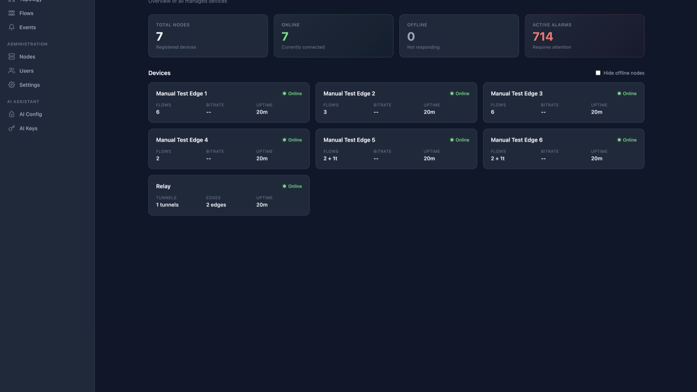
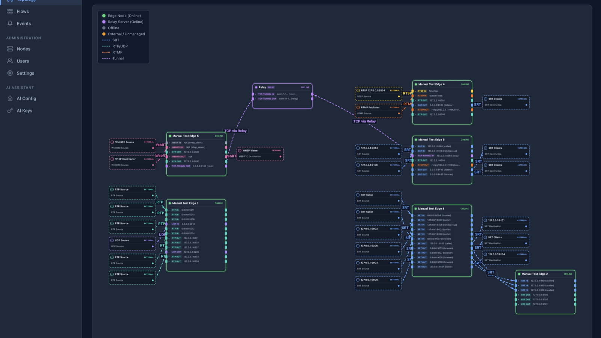
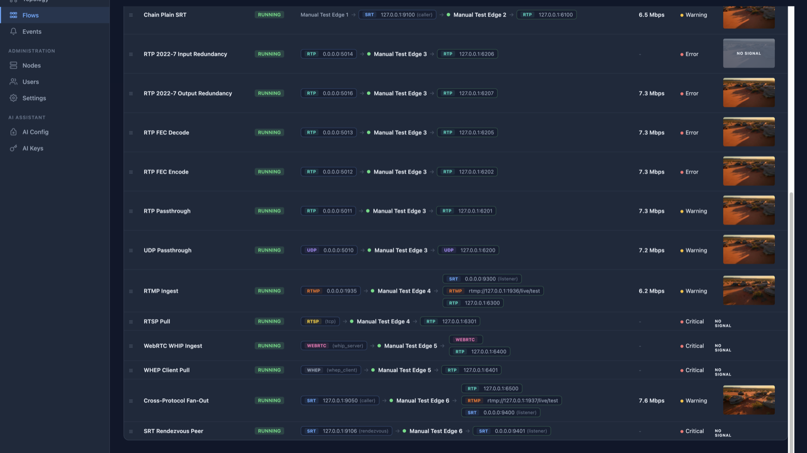
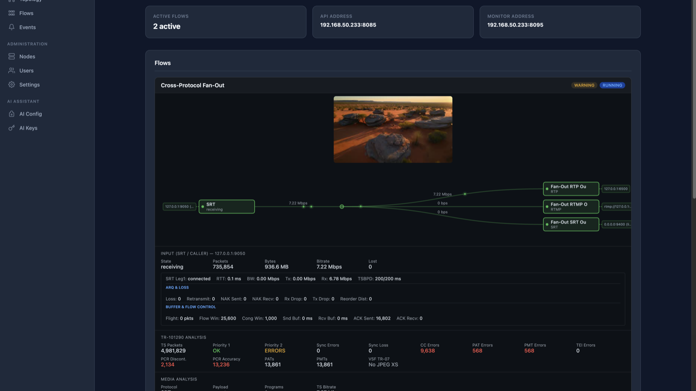
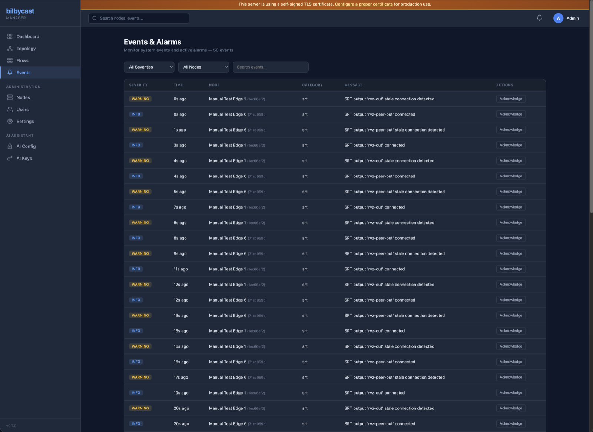
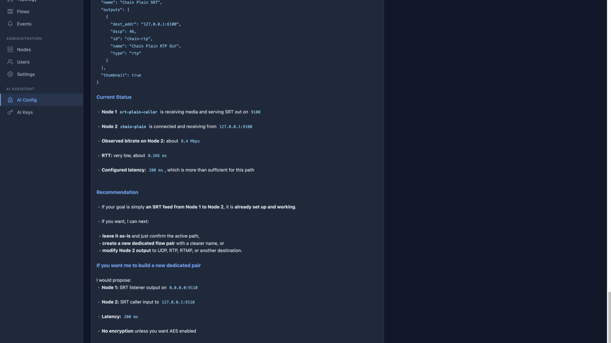

# bilbycast-manager

**Centralised control plane for broadcast-grade live-media transport.**

bilbycast-manager is the management UI and orchestration service for the Bilbycast transport suite. One web UI to configure flows, build network topologies, monitor signal health, and operate live video/audio delivery across SRT, RIST, RTP/UDP, RTMP, RTSP, HLS, CMAF-LL, WebRTC, and SMPTE ST 2110. Manages `bilbycast-edge` media gateways, `bilbycast-relay` NAT-traversal servers, and third-party broadcast devices (Appear X and other gateways) through a driver-aware architecture.

This repository hosts the **official binary releases only** — the source is proprietary. See [Licence](#licence) below.



## What you can do with it

- **Visual topology** — drag-and-drop flow and signal-path view across your entire broadcast plant. Switch between force-directed graph and left-to-right signal-flow layouts.
- **Configure flows end-to-end** — ingress → optional transcode → egress, with hitless SMPTE 2022-7 redundancy, FEC, bonding, and end-to-end tunnel encryption configured through the UI instead of hand-editing JSON.
- **AI-assisted configuration** — describe the flow you want in natural language; the manager generates the edge config, validates it, and shows a preview before applying.
- **Real-time observability** — per-flow bitrate, loss, latency, PTP lock state, NMOS IS-04/05/08 status, and live video thumbnails (one per flow, refreshed every 10 seconds).
- **Structured events and alarms** — every port conflict, bind failure, authentication event, or protocol anomaly is emitted as a categorised event with severity and drill-down detail.
- **Driver-aware integration** — native control of `bilbycast-edge` and `bilbycast-relay`, plus out-of-band management of third-party broadcast devices (Appear X units today, more gateways planned) under the same UI and event model.
- **Enterprise-ready auth** — argon2id local auth, TOTP MFA, licensed OIDC SSO (Okta / Azure AD / Keycloak / Google Workspace), role-based access control, per-node access scopes, audit logs.
- **Encrypted at rest** — node credentials, AI keys, tunnel keys, TOTP secrets, and recovery codes sit under AES-256-GCM envelope encryption keyed to a per-deployment master key. One-command master-key rotation, full encrypted backup / restore.
- **TLS out of the box** — ACME / Let's Encrypt autoprovisioning, file-based certs, or a behind-proxy mode. Cert fingerprint pinning on the edge/relay clients.



## Flow configuration

Build flows in the UI: pick ingress + egress, drop in transcoders, attach bonding legs or FEC, enable hitless 2022-7 redundancy, pick input/output ports, set SRT / RIST / RTMP / ST 2110 parameters, and push. Manager and edge reconcile config in both directions — the node's config file is always ground truth.



## Signal health

Per-flow video thumbnails, bitrate graphs, packet loss, jitter, PTP lock state, NMOS receiver-capabilities compliance. Click any flow for the full stats pane.



## Operational events and alarms

Structured events with severity, category, and optional `flow_id` — covering port conflicts, bind failures, authentication events, config-sync drift, NMOS / PTP state changes, and protocol-level anomalies. Events are queryable, filterable, and (for Enterprise deployments) forwarded to external systems.



## AI-assisted flow design

Describe the flow you want — "pull this SRT listener, transcode to H.264 2 Mbps, deliver as RTMP to YouTube and as MPEG-TS over UDP multicast on the studio LAN" — and the assistant drafts the flow config, validates it against the driver, shows you a diff, and applies it on confirm.



## Licence

bilbycast-manager is licensed under the **bilbycast-manager End-User Licence Agreement** (EULA), published by Softside Tech Pty Ltd (ACN 606961077). A copy is included as [`LICENSE`](LICENSE) and hosted at [`https://bilbycast.com/eula`](https://bilbycast.com/eula).

**By downloading, installing, or using any binary distributed from this repository, you agree to be bound by the EULA.** If you do not agree, do not download or install the Software.

The EULA has **two licence tracks** — pick whichever fits your use case:

- **Community Licence** (EULA §3.4) — free, perpetual, up to **10 Managed Nodes**, for your own broadcast operations (including operations for your own clients, where you operate the Software). No paid Order required. Covers evaluation and small production plants.
- **Commercial Licence** (EULA §3.1 + Order) — above 10 nodes, hosted / SaaS offerings, OEM embedding in third-party appliances, bundled support SLA, or any combination. Contact `contact@bilbycast.com`.

Both tracks prohibit reverse engineering, redistribution, SaaS resale to third parties, appliance embedding, and Licence Key circumvention — see EULA §4 (Restrictions) and §5 (Licence Keys and enforcement). Usage may be audited under EULA §6 (Audit and compliance verification). Data-handling practices are described in the Privacy Policy at [`https://bilbycast.com/privacy`](https://bilbycast.com/privacy).

Third-party open-source components bundled with the Software are listed in [`NOTICE`](NOTICE). Those components remain licensed under their respective open-source licences and are unaffected by the EULA.

## Installation

Each release publishes a static musl Linux x86_64 tarball with no runtime dependencies. Check the [Releases](../../releases) tab for the most recent build.

```bash
# Download the latest release
curl -LO https://github.com/Bilbycast/bilbycast-manager-releases/releases/latest/download/bilbycast-manager-x86_64-linux.tar.gz
curl -LO https://github.com/Bilbycast/bilbycast-manager-releases/releases/latest/download/bilbycast-manager-x86_64-linux.tar.gz.sha256

# Verify the checksum
sha256sum -c bilbycast-manager-x86_64-linux.tar.gz.sha256

# Extract and start
tar xzf bilbycast-manager-x86_64-linux.tar.gz
cd bilbycast-manager-*/

export BILBYCAST_JWT_SECRET=$(openssl rand -hex 32)
export BILBYCAST_MASTER_KEY=$(openssl rand -hex 32)

./bilbycast-manager setup           # one-time: init DB + first admin user
./bilbycast-manager serve --config config/default.toml
```

Each tarball contains:

```
bilbycast-manager-<version>/
  bilbycast-manager        # binary (static musl)
  migrations/              # SQLite migrations (auto-applied on startup)
  config/default.toml      # default configuration
```

Complete installation, TLS, and configuration documentation is published at [`https://bilbycast.com/getting-started`](https://bilbycast.com/getting-started).

## System requirements

- Linux x86_64 (any modern distribution — musl build, no glibc version dependency)
- ~200 MB disk, ~100 MB RAM at idle; memory scales with connected-node count
- Open TCP port for the web UI and WebSocket (default `8443`); optional port `80` if ACME is enabled

Edges and relays managed by bilbycast-manager run on the same hardware-class envelope — see [`https://github.com/Bilbycast/bilbycast-edge`](https://github.com/Bilbycast/bilbycast-edge) for the edge / relay side.

## Enquiries

- **General enquiries**: `contact@bilbycast.com`

## Source code availability

The bilbycast-manager source is proprietary. Access to source is provided to commercial licensees under negotiated terms — contact `contact@bilbycast.com` to discuss source-availability options for your deployment.

Related **open-source** projects in the Bilbycast suite are published at [`https://github.com/Bilbycast`](https://github.com/Bilbycast):

- [`bilbycast-edge`](https://github.com/Bilbycast/bilbycast-edge) — media transport gateway (AGPL-3.0-or-later)
- [`bilbycast-relay`](https://github.com/Bilbycast/bilbycast-relay) — NAT-traversal relay (AGPL-3.0-or-later)
- [`bilbycast-srt`](https://github.com/Bilbycast/bilbycast-srt) — pure-Rust SRT (MPL-2.0)
- [`bilbycast-rist`](https://github.com/Bilbycast/bilbycast-rist) — pure-Rust RIST Simple Profile (MPL-2.0)
- [`bilbycast-libsrt-rs`](https://github.com/Bilbycast/bilbycast-libsrt-rs) — Rust wrapper over Haivision libsrt with bonding (MPL-2.0)
- [`bilbycast-fdk-aac-rs`](https://github.com/Bilbycast/bilbycast-fdk-aac-rs) — Rust wrapper over Fraunhofer FDK AAC (MPL-2.0)
- [`bilbycast-ffmpeg-video-rs`](https://github.com/Bilbycast/bilbycast-ffmpeg-video-rs) — Rust wrapper over FFmpeg libavcodec (MPL-2.0)
- [`bilbycast-bonding`](https://github.com/Bilbycast/bilbycast-bonding) — media-aware packet bonding (MPL-2.0)
